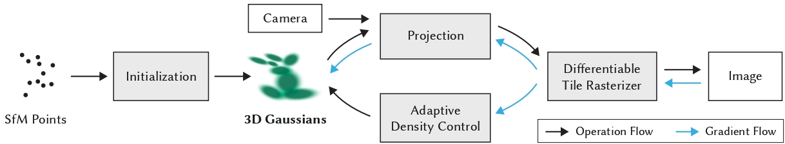

# 3D Gaussian Splatting



[](https://arxiv.org/abs/2308.04079)
[](https://github.com/AndrewBoessen/3DGS/actions)
[](https://github.com/AndrewBoessen/3DGS/releases)
[](https://en.cppreference.com/w/cpp/23)
[](https://developer.nvidia.com/cuda-downloads)

A minimalist CUDA and C++ implementation of **3D Gaussian Splatting** for real-time radiance field rendering.
This repository provides a lightweight foundation for experimenting with the core ideas from the original paper.

## Installing

### 1. Core Build Environment

You will need a standard C++ development toolchain. Please install the following using your system's package manager (e.g., `apt` for Debian/Ubuntu, `brew` for macOS).

- **C++ Compiler** with C++23 support (e.g., GCC 12+, Clang 15+)

- **CMake** (version 3.20 or later)

- **OpenCV**

For example, on Ubuntu 22.04, you can install these with:

```bash
sudo apt install cmake build-essential g++-12 libopencv-dev
```

### 2. NVIDIA CUDA Toolkit

A compatible NVIDIA driver and the CUDA Toolkit are required for the GPU-accelerated components.

- **NVIDIA CUDA Toolkit** (version 13.0 or later)

Please download and install the appropriate version for your system from the [**NVIDIA CUDA Toolkit website**](https://developer.nvidia.com/cuda-downloads). After installation, ensure that the `PATH`, `CPLUS_INCLUDE_PATH`, and `LD_LIBRARY_PATH` environment variables are configured correctly in your shell profile (e.g., `.bashrc`).

## Building

### 1. **Clone the repository:**

```bash
git clone --recursive https://github.com/AndrewBoessen/3DGS.git
cd 3DGS
```

### 2. **Configure with CMake:** Create a build directory and run CMake

```bash
cmake -S . -B build
```

_Note: If you have multiple compilers, you can specify one, e.g., `-DCMAKE_CXX_COMPILER=g++-12`._

### 3. **Compile the code:** Build the project using CMake

```bash
cmake --build build --parallel $(nproc)
```

The main executable, `gaussian_splatting`, will be located in the `build/` directory.

## Using


### Mip-NeRF 360

To train a scene from the Mip-NeRF 360 dataset specify the scene to train in the config file: `base.yaml` or `extended.yaml` and run the main executable.

```bash
./build/gaussian_splatting <path_to_config> <path_to_dataset>
```

For example

```bash
./build/gaussian_splatting ./config/extended.yaml ../Downloads/360_v2
```

### Colab

[](https://colab.research.google.com/github/AndrewBoessen/3DGS/blob/main/assets/3DGS.ipynb)

A Colab notebook is available to train a demo scene and view rendered images.

### COLMAP

## Testing

The project includes a suite of unit tests built with Google Test. The tests are compiled automatically during the main build process.

To run all tests, execute `ctest` from within the build directory. The `--output-on-failure` flag is recommended to only show logs for failing tests.

```bash
cd build
ctest --output-on-failure
```

This will discover and run all test executables, including those for the CUDA kernels.
