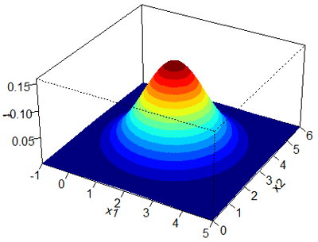
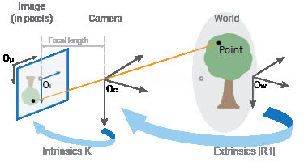
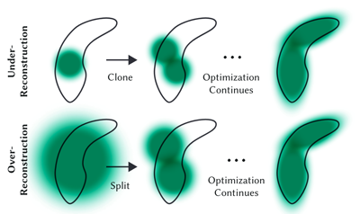

# 3D Gaussian Splatting

A minimalist CUDA and C++ implementation of **3D Gaussian Splatting** for real-time radiance field rendering.
This repository provides a lightweight foundation for experimenting with the core ideas from the original paper.

## Installing

## Building

## Using

### Mip-NeRF 360

### COLMAP

## Technical Details

### 3D Gaussian Distribution

A 3D Gaussian distribution is defined by its **mean vector** $\boldsymbol{\mu} \in \mathbb{R}^3$ and **covariance matrix** $\boldsymbol{\Sigma} \in \mathbb{R}^{3 \times 3}$.

The probability density function (PDF) is given by:

$$
\mathcal{N}(\mathbf{x} \mid \boldsymbol{\mu}, \boldsymbol{\Sigma}) =
\frac{1}{(2\pi)^{3/2} \, |\boldsymbol{\Sigma}|^{1/2}}
\exp\left( -\tfrac{1}{2} (\mathbf{x} - \boldsymbol{\mu})^\top \boldsymbol{\Sigma}^{-1} (\mathbf{x} - \boldsymbol{\mu}) \right)
$$

where:
- $\mathbf{x} \in \mathbb{R}^3$ is a 3D point,  
- $|\boldsymbol{\Sigma}|$ is the determinant of the covariance matrix,  
- $\boldsymbol{\Sigma}^{-1}$ is its inverse.  

#### Representation

The covariance matrix $\boldsymbol{\Sigma}$ is symmetric positive semidefinite, and can be factorized to store it more efficiently.  
A common parameterization in **3D Gaussian Splatting** is to decompose $\boldsymbol{\Sigma}$ into a **rotation matrix** $\mathbf{R} \in SO(3)$ and a **scale vector** $\mathbf{s} \in \mathbb{R}^3$, such that:

$$
\boldsymbol{\Sigma} = \mathbf{R} \, \mathrm{diag}(\mathbf{s}^2) \, \mathbf{R}^\top
$$

where $\mathrm{diag}(\mathbf{s}^2)$ is a diagonal matrix with squared scale values.

This form arises naturally from the **Singular Value Decomposition (SVD)** of the covariance matrix:

$$
\boldsymbol{\Sigma} = \mathbf{U} \, \mathbf{S} \, \mathbf{U}^\top
$$

with $\mathbf{U}$ orthogonal and $\mathbf{S}$ diagonal with nonnegative entries.
Here,
- $\mathbf{R} \equiv \mathbf{U}$,
- $\mathbf{s} \equiv \sqrt{\mathrm{diag}(\mathbf{S})}$.

Thus, the Gaussian can be compactly stored as $(\boldsymbol{\mu}, \mathbf{R}, \mathbf{s})$, and the full covariance matrix can be reconstructed by reversing the factorization.

### SfM (Structure from Motion)

#### Point Cloud

### Cameras

#### Translation

#### Projection (Pinhole Camera)

### Rasterization

#### 3D to 2D Gaussian

#### Frustum Culling

#### Alpha Blending

### Optimization

#### Parameters

#### Adaptive Density

##### Cloning (Under Representation)

##### Splitting (Over Representation)
